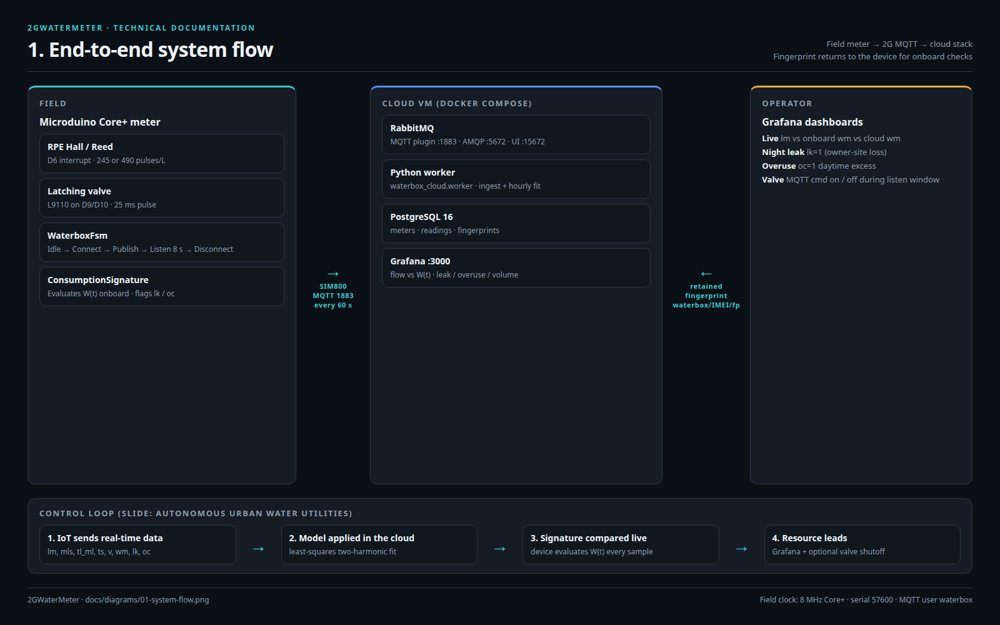
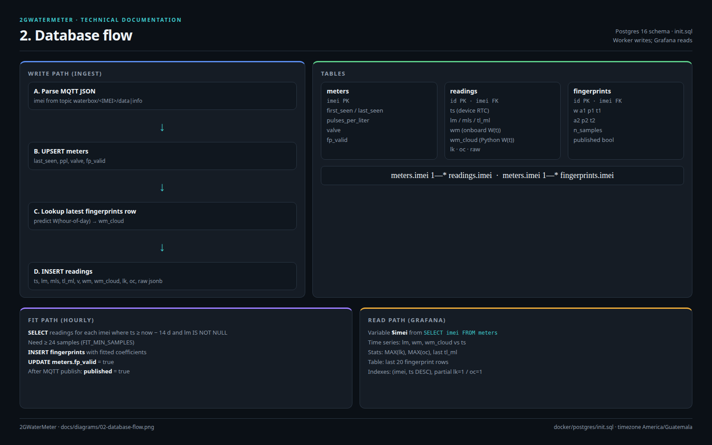
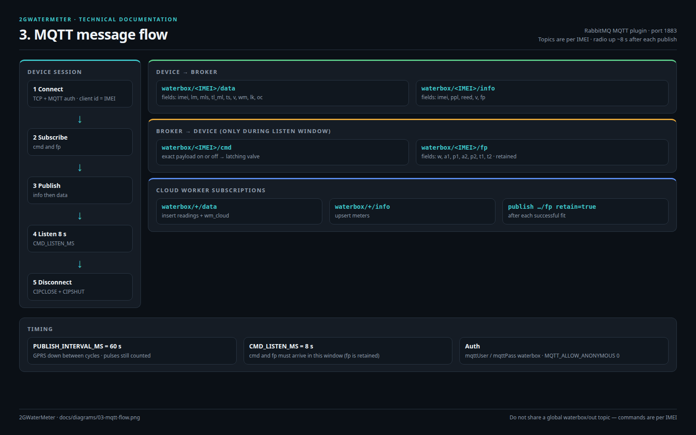
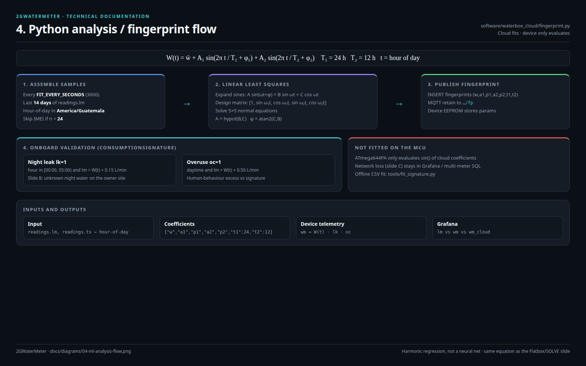

# Architecture

Technical illustrations for the 2GWaterMeter stack: field meter, RabbitMQ MQTT, Python worker, PostgreSQL, Grafana, and onboard fingerprint checks.

Source HTML for the figures lives in [`diagrams/`](diagrams/) (1600×1000). PNGs are the committed images.

## 1. System flow

The Core+ counts flow, publishes MQTT over SIM800 every 60 s, then listens 8 s for `cmd` / `fp`. Docker Compose on the cloud VM runs RabbitMQ (MQTT plugin), the Python worker, Postgres, Grafana (operators, :3000), and the **household portal** (`user_portal`, :3001). Fitted fingerprints are published back to the device. Households log in with email or IMEI, see volume charts, overlay monthly \(W(t)\), and map usage vs neighbors.

## 2. Database flow

Ingest upserts `meters`, looks up the latest fingerprint to compute `wm_cloud`, then inserts `readings`. The hourly fit inserts `fingerprints`. Grafana only reads.

Schema: [`docker/postgres/init.sql`](../docker/postgres/init.sql).

## 3. MQTT message flow

| Topic | Direction | Payload |
|-------|-----------|---------|
| `waterbox/<IMEI>/data` | device → broker | `imei, lm, mls, tl_ml, ts, v, wm, lk, oc` |
| `waterbox/<IMEI>/info` | device → broker | `imei, ppl, reed, v, fp` |
| `waterbox/<IMEI>/hb` | device → broker | hourly health: `up, v, fp, lk, oc, rssi, tl_ml, ok` |
| `waterbox/<IMEI>/cmd` | broker → device | `on`/`open`/`1` or `off`/`close`/`0` (or `{"v":1}`) |
| `waterbox/<IMEI>/fp` | broker → device | `w, a1, p1, a2, p2, t1, t2` (retained) |

On connect the meter **subscribes** to `cmd` and `fp`. Worker subscribes `waterbox/+/data`, `/info`, and `/hb`. Commands and fingerprints only land while the modem is in the listen window; `fp` is retained so the next session still sees it. Heartbeats piggyback on a radio session at most once per hour.

## 4. Python analysis / fingerprint flow

Cloud fit (not a neural net) of the slide model:

\[
W(t)=\bar{w}+A_1\sin\left(\frac{2\pi}{T_1}t+\varphi_1\right)+A_2\sin\left(\frac{2\pi}{T_2}t+\varphi_2\right)
\]

with \(T_1=24\,\mathrm{h}\), \(T_2=12\,\mathrm{h}\). The MCU only evaluates \(W(t)\) and sets `lk` (night leak) / `oc` (overuse). Details: [`SIGNATURE.md`](SIGNATURE.md). Code: [`software/waterbox_cloud/fingerprint.py`](../software/waterbox_cloud/fingerprint.py).

## Illustrations

Photo-style stills of the box, city deployment, fingerprint, and operations room: [`ILLUSTRATIONS.md`](ILLUSTRATIONS.md).

## Related

- Cloud runbook: [`software/README.md`](../software/README.md)
- Compose stack: [`docker/docker-compose.yml`](../docker/docker-compose.yml)
- Wiring and topics: [`WIRING.md`](WIRING.md)
