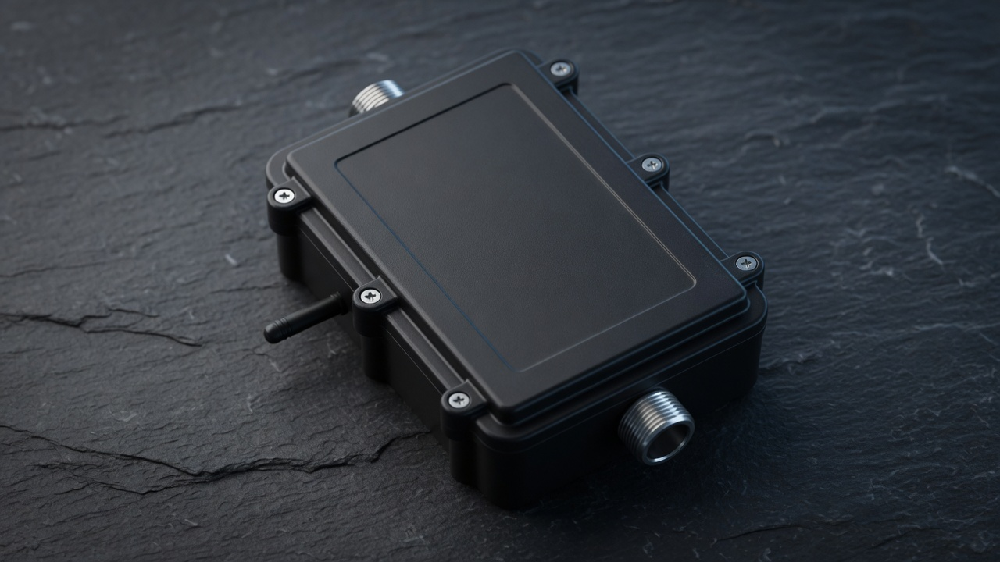
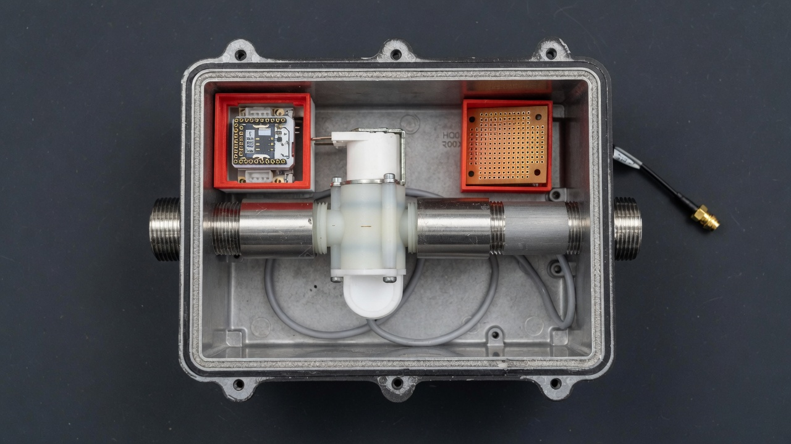
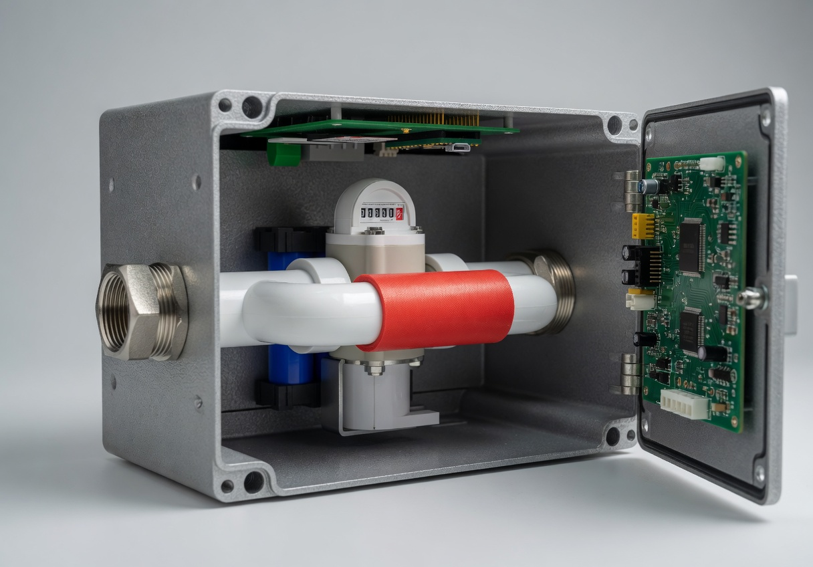
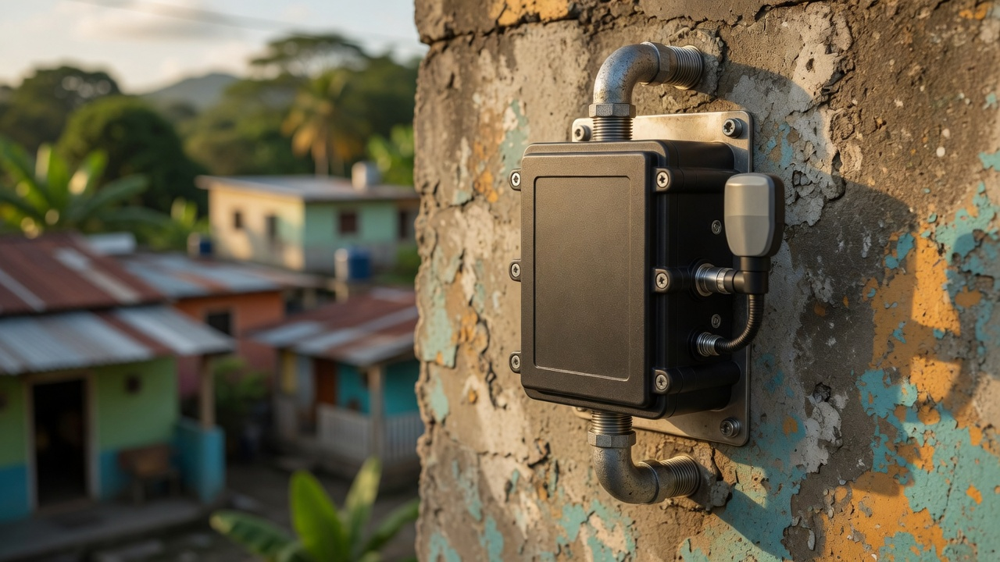
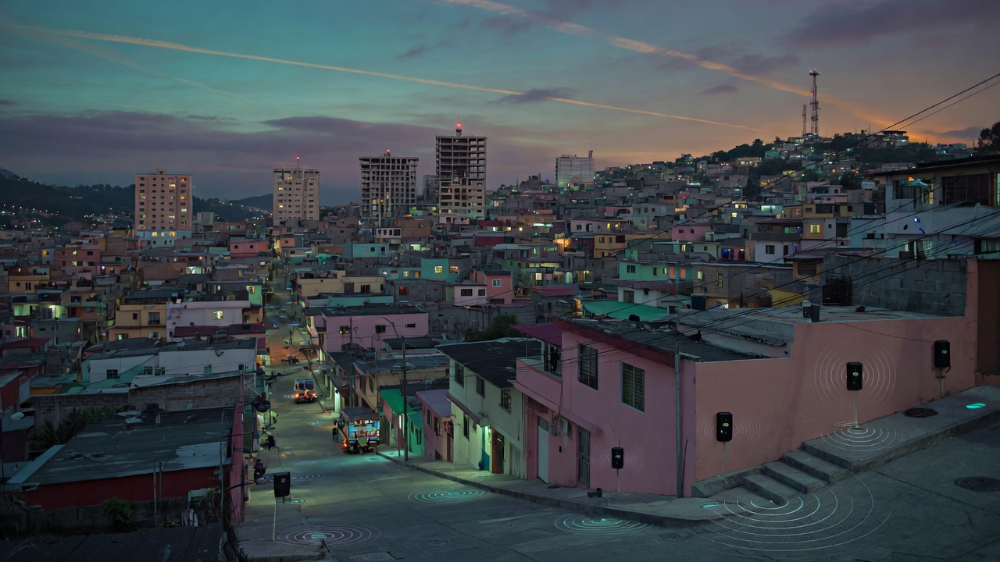
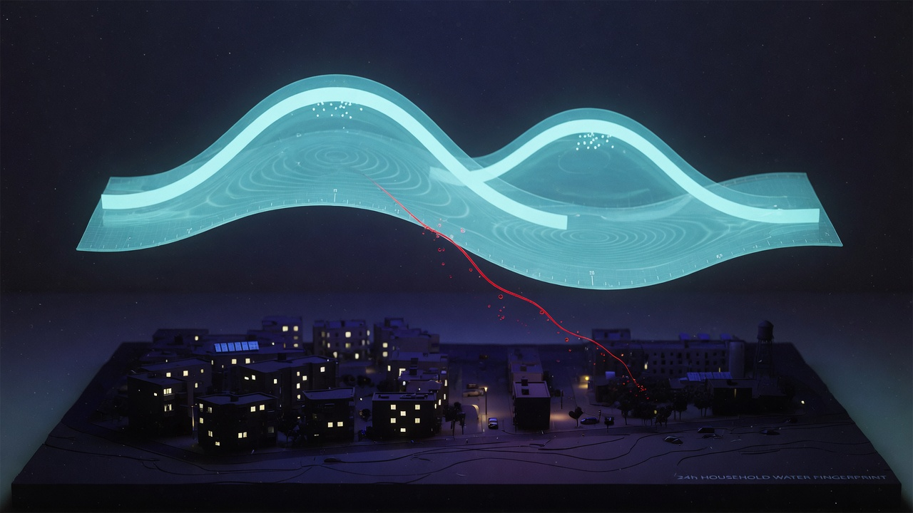
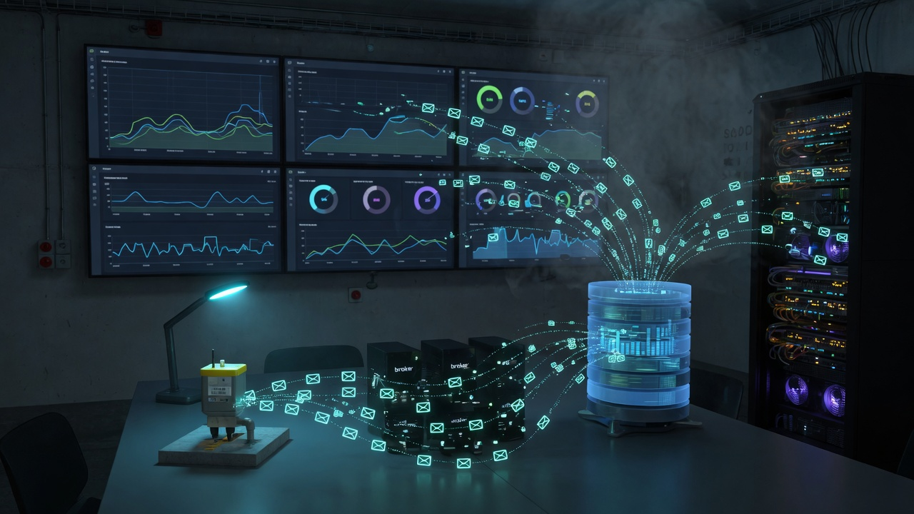

# Project illustrations

Concept and product stills generated from the hardware photos, CAD render, and cloud architecture. They are mood and documentation art, not measured drawings. Exact labeled flows remain in [`ARCHITECTURE.md`](ARCHITECTURE.md).

## Hardware

| File | Based on | Use |
|------|----------|-----|
| [hero-enclosure.jpg](illustrations/hero-enclosure.jpg) | Prototype closed box | Product hero |
| [prototype-interior.jpg](illustrations/prototype-interior.jpg) | Photo 20160727_200548 | As-built internals |
| [production-cutaway.jpg](illustrations/production-cutaway.jpg) | SketchUp Captura7Valvula | Lid-mount production target |
| [field-install.jpg](illustrations/field-install.jpg) | Hero enclosure | Wall-mounted field unit |

## System story

| File | Story |
|------|--------|
| [urban-deployment.jpg](illustrations/urban-deployment.jpg) | City-scale meters reporting over 2G |
| [consumption-fingerprint.jpg](illustrations/consumption-fingerprint.jpg) | 24 h / 12 h usage ribbon; night leak as a stray filament |
| [cloud-operations.jpg](illustrations/cloud-operations.jpg) | MQTT → broker → Postgres → Grafana |

